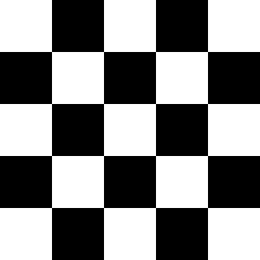
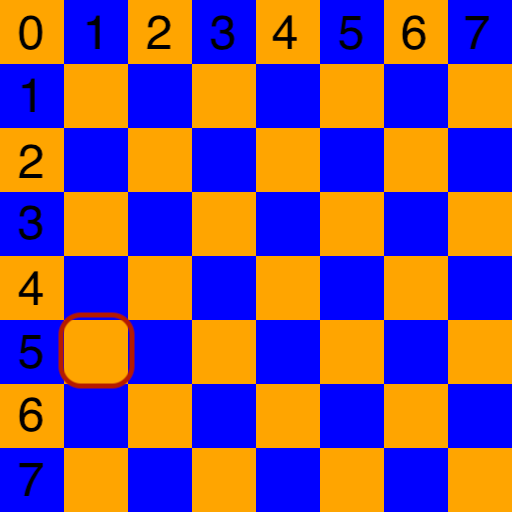
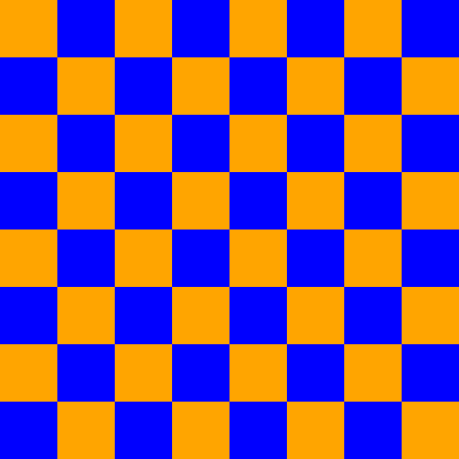

# CPSC 120

# This is an optional exercise.

## More Patterns With Loops

We all have seen a [checkerboard pattern](https://en.wikipedia.org/wiki/Checkerboard) before. We use them to make game boards for chess and checkers. We use the checker flag to represent the end of a race.



The checkerboard image above is a 5 by 5 board. There are alternating square cells of black and white [pixels](https://en.wikipedia.org/wiki/Pixel). Each cell is 64 pixels tall and 64 pixels wide.

How would you write a program that creates this pattern? There is a pattern. Can the pattern be expressed as a loop?

We could try to alternate colors for one row; white, black, white, black, white. And the next row, we would alternate starting with the next color from the previous row; black, white, black, white, black. We could continue this for as many rows as we need.

This sounds like a good plan. Will it work?

Each block of color is composed of many pixels. In fact, each block is 64 pixels by 64 pixels which means there are 4,096 pixels for each block. And each block spans many rows and many columns. Our initial plan to alternate colors _for every pixel_ will not work.

What we need is an approach that will alternate colors for every block. Which means that if we know the coordinate of the pixel in the image, we can figure out what color it ought to be.

Let's assume our algorithm will create the image one scan line at a time. That means that for each row of pixels (y direction), our algorithm will figure out what color to set for each pixel going across each column (x direction). Using row and column, we can locate every pixel in the image. This will be our coordinate system.

In our image we will have 8 blocks across and 8 blocks down. Any given [scan line](https://en.wikipedia.org/wiki/Scan_line) will have 8 × 64 pixels or 512 pixels.

Let's pick an arbitrary location in the image; the pixel at location (123, 353). What color should this pixel be? We know that each block is 64 pixels across so if we divide 123 ÷ 64 we see that we are in block 1, the 2nd block horizontally. Remember, 123 ÷ 64 is 1, remainder 59 and we start counting from 0. In the other direction, we divide 353 ÷ 64 and we see that we are in block 5, the 6th block vertically.

The block is marked in the sample image.



We can alternate between blocks by using the modulo operator `%`. Given a number we can use the operation `% 2` to see if it is even or odd. For example `4 % 2 == 0` so 4 is even and `7 % 2 != 0` so 7 is odd.

Given our pixel's address, dividing by 64 will tell us which block we are in and modding that block's coordinate by 2 will tell us which color to use.

In our example, pixel location (123, 353) is in block (1, 5) and it is orange. Modding (1, 5) gives us `1 % 2 == 1` and `5 % 2 == 1`. The next block over is (2, 5) which means that it must be a different color than block (1, 5). In the image you can see that block (2, 5) is blue. Consider that `2 % 2 == 0` and `5 % 2 == 1`. Similarly, if we move down from block (1, 5) to block (1, 6) the color changes to blue and `1 % 2 == 1` and `6 % 2 == 0`.

Things look pretty clear until you consider block (4, 2). What color is that block? Block (4, 2) is orange and `4 % 2 == 0` and `2 % 2 == 0`. In our earlier examples, if we modded the block's address by 2 and both came up as 1, then the block's color is orange. If the modded address was a combination of 1 and 0 then the block was colored blue. And if we mod the block's address and both come up as 0, then the block's color is orange as well.

This intuitive approach will work well. However you may be interested in knowing that we could come up with an identical solution using some bitwise operators. We don't study bitwise operators in this class but it may be a fun thing to know about.

[Bit twiddling or bit manipulation](https://en.wikipedia.org/wiki/Bit_manipulation) is the skill and art of manipulating small pieces of data using bitwise operators. The operators we are using (indirectly) are [bitwise AND operator](https://en.wikipedia.org/wiki/Bitwise_operation#AND) and the [bitwise XOR operator](https://en.wikipedia.org/wiki/Bitwise_operation#XOR). These operators are also common gates which are used in digital logic, [XOR gate](https://en.wikipedia.org/wiki/XOR_gate) and [AND gate](https://en.wikipedia.org/wiki/AND_gate). We can simplify our algorithm's logic using the analytical representation of an XOR gate, .

To summarize, write a nested for loop where the outer loop is for every row and the inner loop is for every column. In the body of the loop, calculate the block address by dividing row by 64 and column by 64. Then mod the block address by 2. Using the evenness or oddness of the block address, set the color of the pixel either to blue or orange.

## Requirements

Write a program that recreates the PNG image shown below in the Example Output section. The image must be 512 pixels by 512 pixels and each colored block must be 64 pixels by 64 pixels. The upper left corner block must be orange.

Use the ImageMagick library to create the image as demonstrated in the starter code.

You must use loops to programmatically create the colors in the image. There must be at least one loop in your program. You may use any combination of for loops, while loops, and do-while loops.

Use the algorithm specified above to create the image.

The starting code defines a series of `TODO` comments which you can use to formulate your plan and develop your program.

Write your program progressively. Compile your program often and check that you're making progress. Make sure your program behaves the way you expect.

The output of your program must match the output given in the section Example Output below.

To compile your program, you use the `make` command. A Makefile is provided for this exercise.

The Makefile has the following targets:
  
* all: builds the project
* clean: removes object and dependency files
* spotless: removes everything the clean target removes and all binaries
* format: outputs a [`diff`](https://en.wikipedia.org/wiki/Diff) showing where your formatting differes from the [Google C++ style guide](https://google.github.io/styleguide/cppguide.html)
* lint: output of the [linter](https://en.wikipedia.org/wiki/Lint_(software)) to give you tips on how to improve your code
* header: check to make sure your files have the appropriate header
* test: run tests to help you verify your program is meeting the assignment's requirements. This does not grade your assignment.

## Don't Forget

Please remember that:

- You need to put a header in every file.
- You need to follow the [Google C++ Style Guide](https://google.github.io/styleguide/cppguide.html).
- Remove the `TODO` comments.

## Testing Your Code

Computers only ever do exactly what they are told, exactly the way they are told it, and never anything else. Testing is an important process to writing a program. You need to test for the program to behave correctly and test that the program behaves incorrectly in a predictable way.

As programmers we have to remember that there are a lot of ways that we can write the wrong program and only one to a few ways to write the correct program. We have to be aware of [cognitive biases](https://en.wikipedia.org/wiki/List_of_cognitive_biases) that we may exercise that lead us to believe we have correctly completed our program. That belief may be incorrect and our software may have errors. [Errors in software](https://www.wired.com/2005/11/historys-worst-software-bugs/) may lead to loss of [life](https://www.nytimes.com/2019/03/14/business/boeing-737-software-update.html), [property](https://en.wikipedia.org/wiki/Mariner_1), [reputation](https://en.wikipedia.org/wiki/Pentium_FDIV_bug), or [all of the above](https://en.wikipedia.org/wiki/2009%E2%80%9311_Toyota_vehicle_recalls).

### Test strategy

Start simple, and work your way up. Good tests are specific, cover a broad range of fundamentally different possibilities, can identify issues quickly, easily, and directly, without need for much set up, and can almost be diagnosed by inspection if the code fails to execute the test correctly.

## Example Output

Please ensure your program's output is identical to the example below.

```
$ make
set -e; clang++ -MM -g -O3 -Wall -pipe -std=c++14  -D LINUX -I/usr/include/GraphicsMagick -D AMD64 checkerboard.cc \
| sed 's/\(checkerboard\)\.o[ :]*/\1.o checkerboard.d : /g' > checkerboard.d; \
[ -s checkerboard.d ] || rm -f checkerboard.d
clang++ -g -O3 -Wall -pipe -std=c++14  -D LINUX -I/usr/include/GraphicsMagick -D AMD64 -c checkerboard.cc
clang++ -g -O3 -Wall -pipe -std=c++14 -lGraphicsMagick++ -o checkerboard checkerboard.o 
$ ./checkerboard 
$ gio open checkerboard.png
```

The command `gio open checkerboard.png` will open the image in your image viewer. The image must be identical to the one shown below.




